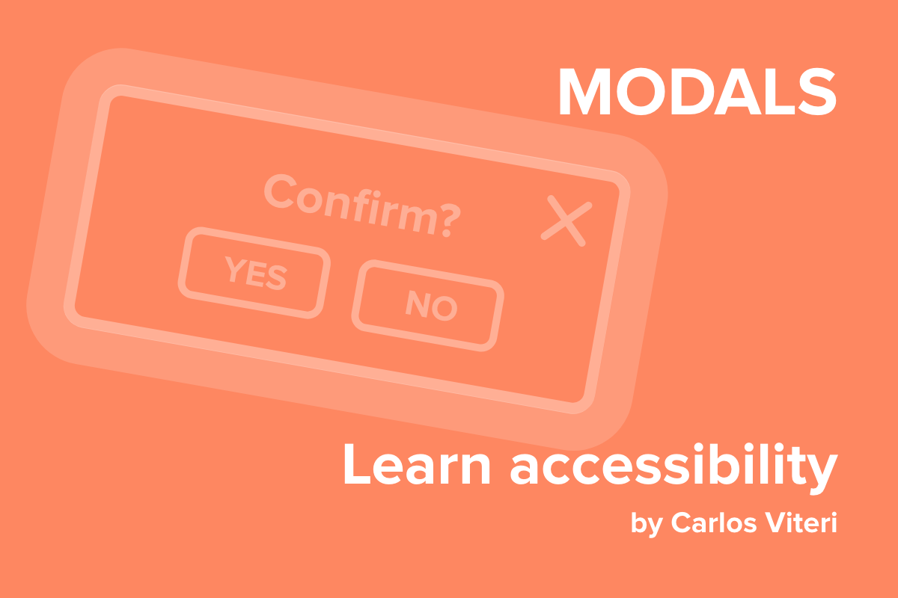

Los modales son frecuentemente usado en la web. Especialmente para confirmar acciones, mostrar anuncios, manejar forms, etc.

Sin embargo, ¿estás creando modales accesibles?, ¿puedes abrirlos y cerrarlos usando solamente el teclado?, ¿están correctamente interpretados por las tecnologías asistivas?

Sino, no te preocupes, hagamos uno desde cero.

### HTML

```html
<button class="button">¿Eliminar item?</button>

<div aria-hidden="true" class="modal">
  <div class="modal__backdrop" tabindex="-1">
    <div aria-labelledby="modal-title" aria-modal="true" class="modal__container" role="dialog">
      <header class="modal__header">
        <h2 id="modal-title">Confirmar?</h2>
        <button aria-label="Close modal">×</button>
      </header>
      <div class="modal__content">
        <p>Esta es la descripcion de un modal accesible</p>
      </div>
      <footer class="modal__footer">
        <button>Sí</button>
        <button aria-label="Close modal">No</button>
      </footer>
    </div>
  </div>
</div>
```

En el código de arriba, basicamente tenemos dos nodos: **el botón para abir el modal** y **el modal**.

Explicaciones de los atributos `aria` y `role`.

`aria-hidden="true"` este atributo **elimina el contenido del árbol de accesibilidad**. Debemos asignar el valor de este atributo como `"false"` una vez que abramos el modal.

`aria-labelledby="id"` va a decirle a las tecnologías asistivas que **el contenido del id, en este caso el heading nivel 2 es lo que describe el dialogo**.

`aria-modal="true"` le informa a las tecnologías asistivas que **el contenido detrás de este modal es inerte, es decir no debe ser tomado en cuenta**.

`role="dialog"` **ayuda a las tecnologías asistivas a identificar el contenido del diálogo como agrupado y separado del resto del contenido de la página**. Pero _este atributo por si solo no es suficiente, siempre debe estar etiquedado y manejar el foco del teclado correctamente_.

`aria-label` **es usado para definir un sting que etiqueta el elemento actual**. En los botones de arriba _estamos usando este atributo para explicar mejor qué hacen, solo es necesario cuando el texto dentro del botón no es lo suficientemente explicativo_.

El primer botón no tiene ningún atributo `aria` porque el texto que tiene dentro es suficiente para explicar el propósito del botón.

### CSS

```css
.modal[aria-hidden="true"] {
  display: none;
}

.modal__backdrop {
  align-items: center;
  background-color: rgba(0, 0, 0, 0.6);
  bottom: 0;
  display: flex;
  justify-content: center;
  left: 0;
  position: fixed;
  right: 0;
  top: 0;
}

.modal__container {
  background-color: white;
  max-height: 100vh;
  max-width: 400px;
  overflow-y: auto;
  padding: 20px;
}

.modal__header {
  align-items: center;
  display: flex;
  justify-content: space-between;
}
```

Primero que todo estamos ocultando el modal si tiene un atributo `aria-hidden="true". Después estamos creando un fondo para tener suficiente contraste entre el modal y el resto de la página. Y finalmente estamos evitando que el contenido vertical se oculte del viewport agregando un scroll del eje Y si el contenido es más alto que `100vh`.

### JavaScript

```js
const focusableElements = [
    '[contenteditable]',
    '[tabindex]:not([tabindex^="-"])',
    'a[href]',
    'area[href]',
    'button:not([disabled]):not([aria-hidden])',
    'embed',
    'iframe',
    'input:not([disabled]):not([type="hidden"]):not([aria-hidden])',
    'object',
    'select:not([disabled]):not([aria-hidden])',
    'textarea:not([disabled]):not([aria-hidden])'
  ];

const modal = document.querySelector('.modal');
const openButton = document.querySelector('.button');
const closeButtons = document.querySelectorAll('.modal__close-button');

document.addEventListener('keydown', handleKeydown);
openButton.addEventListener('click', openModal);
closeButtons.forEach(button =>
	button.addEventListener('click', closeModal)
);

function handleKeydown(e) {
  const esc = 27;

  if (e.keyCode === esc) {
    closeModal();
  }
}

function openModal() {
  const focusableModalElements = modal.querySelectorAll(focusableElements);

  modal.setAttribute('aria-hidden', 'false');

  if (focusableModalElements.length) {
   focusableModalElements[0].focus();
  }
}

function closeModal() {
  modal.setAttribute('aria-hidden', 'true');
}
```

En el JavaScript estamos activando o desactivando el atributo `aria-hidden` dependiendo de qué queremos hacer. Cuando abrimos el modal debemos enfocar el primer elemento enfocable dentro del modal. Y obviamente debemos soportar la tecla `escape` para cerrar el modal.

Working example:

<iframe
  src="https://codesandbox.io/embed/distracted-williams-b97jf?fontsize=14&hidenavigation=1&theme=dark"
  style="width:100%; height:500px; border:0; border-radius: 4px; overflow:hidden;"
  title="accessible-modal"
  allow="geolocation; microphone; camera; midi; vr; accelerometer; gyroscope; payment; ambient-light-sensor; encrypted-media; usb"
  sandbox="allow-modals allow-forms allow-popups allow-scripts allow-same-origin"
></iframe>
