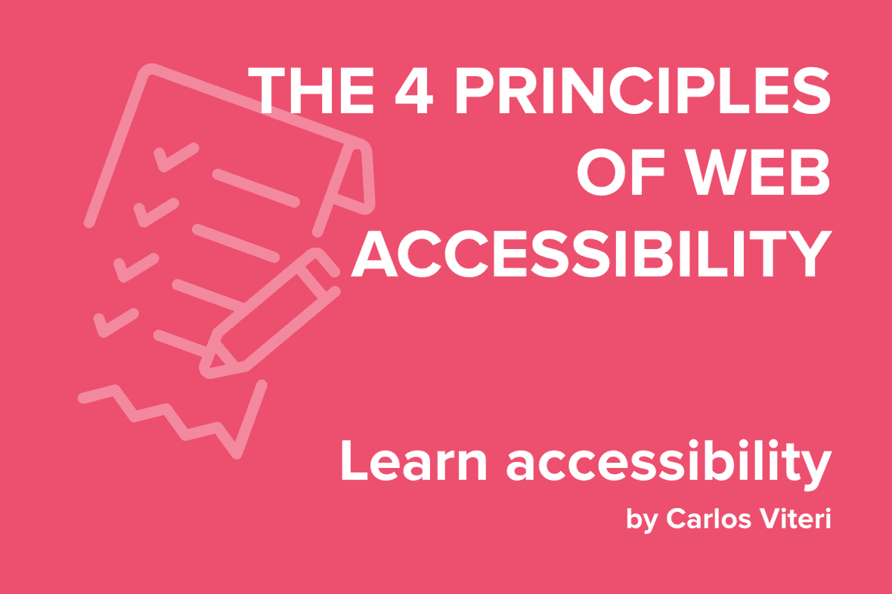

La accesibilidad se refiere al diseño y desarrollo de sitios web, aplicaciones o servicios que pueden ser operados por personas con discapacidades. Abordar los problemas de accesibilidad mejora la experiencia no solo para ese grupo de personas sino para todos.

En el contexto del desarrollo web, la W3C tiene una compilación muy interesante de mejores prácticas y guías escrita por expertos llamada [Web Content Accessibility Guidelines (WCAG) 2.0](http://www.sidar.org/traducciones/wcag20/es/). WCAG se basa en cuatro pautas:

## Pauta 1: Discernible - La información de los componentes de la interfaz de usuario deben ser presentados a los usuarios de formas discernibles.

Los usuarios deben ser capaces de procesar la información de tu aplicación sin ninguna barrera de acceso.

Esto significa que deberías proveer alternativas para personas que tengan sentidos más debiles. Por ejemplo:

**1.1.** Proporcionar alternativas textuales para todo contenido no textual de modo que se pueda convertir a otros formatos que las personas necesiten, tales como textos ampliados, braille, voz, símbolos o en un lenguaje más simple.

**1.2.** Medios tempodependientes: proporcionar alternativas para los medios tempodependientes.

**1.3.** Crear contenido que pueda presentarse de diferentes formas (por ejemplo, con una disposición más simple) sin perder información o estructura.

**1.4.** Facilitar a los usuarios ver y oír el contenido, incluyendo la separación entre el primer plano y el fondo.

## Pauta 2: Operable  - Los componetes de la interfaz de usuario y la navegación deben ser operable.

La operatividad significa que un usuario puede utilizar con éxito la interfaz con una variedad de herramientas, como un mouse, una pantalla táctil o un teclado. Para asegurarse de que funciona como se espera, se recomienda:

**2.1.** Proporcionar acceso a toda la funcionalidad mediante el teclado.

**2.2.** Proporcionar a los usuarios el tiempo suficiente para leer y usar el contenido.

**2.3.** No diseñar contenido de un modo que se sepa podría provocar ataques, espasmos o convulsiones.

**2.4.** Proporcionar medios para ayudar a los usuarios a navegar, encontrar contenido y determinar dónde se encuentran.

También es importante hacer aplicaciones indulgentes, en otras palabras _tu interfaz debería ofrecer opciones como instrucciones, advertencias y cancelaciones_.

## Pauta 3: Entendible  -  La información y el funcionamiento de la interfaz de usuario debe ser entendible.

El _lenguage_ de la interfaz debería ser fácil de comprender. La consistencia entre todos los componentes asegura que el usuario no se llebe una sorpresa.

**3.1.** Hacer que los contenidos textuales resulten legibles y comprensibles.

**3.2.** Hacer que las páginas web aparezcan y operen de manera predecible.

**3.3.** Ayudar a los usuarios a evitar y corregir los errores.

También es importando tener un buen manejo de errores y feedback. Las etiquetas deben ser explícitas y adecuadas para proveer servir como guía en toda la aplicación.

## Pauta 4: Robusto  - El contenido debe ser lo suficientemente robusto como para que pueda ser interpretado de manera confiable por una amplia variedad de user agents, incluidas las tecnologías de asistencia.

Los usuarios eligen su propio stack de tecnologías. Tu aplicación debería ser lo suficientemente robusta para funcionar en la mayoría de navegadores y sistemas operativos con límites razonables.

**4.1.** Maximizar la compatibilidad con las aplicaciones de usuario actuales y futuras, incluyendo las ayudas técnicas.

Una de las mejores maneras de cumplir con el principio de robustez es seguir estándares y convenciones en el desarrollo de la aplicación en todo el equipo de desarrollo.
