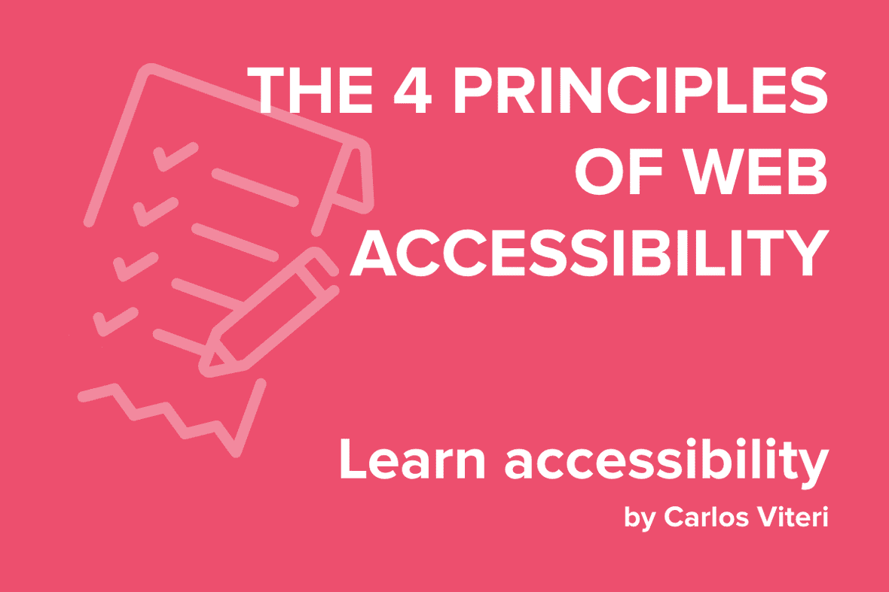

Accessibility refers to the design and development of websites, applications or services that can be operated by people with disabilities. Addressing accessibility issues improves the experience not only for that group of people but for everyone.

In the context of web development, we can take a look at the [Web Content Accessibility Guidelines (WCAG) 2.0](https://www.w3.org/TR/WCAG20/). This is a compilation of best practices and guidelines that were written by accessibility experts. WCAG is based on four principles:

## Principle 1: Perceivable  -  Information and user interface components must be presentable to users in ways they can perceive.

Users must be able to process information without any barriers to access to your application.

This means that you should provide alternatives for people who have weaker senses, such as:

**1.1.** Provide text alternatives for any non-text content so that it can be changed into other forms people need, such as large print, braille, speech, symbols or simpler language.

**1.2.** Provide alternatives for time-based media.

**1.3.** Create content that can be presented in different ways (for example simpler layout) without losing information or structure.

**1.4.** Make it easier for users to see and hear content including separating foreground from background.

## Principle 2: Operable  -  User interface components and navigation must be operable.

Operability means that a user can successfully use the interface with a variety of tools such as a mouse, a touch screen or a keyboard. To make sure it is working as expected it is recommended to:

**2.1.** Make all functionality available from a keyboard.

**2.2.** Provide users enough time to read and use content.

**2.3.** Do not design content in a way that is known to cause seizures.

**2.4.** Provide ways to help users navigate, find content, and determine where they are.

It is also important to make forgiving apps, this means _your interface should offer instructions, warnings and cancellation options_.

## Principle 3: Understandable  -  Information and the operation of user interface must be understandable.

Your _UI language_ should be easy to comprehend. Consistency between all the components ensures that the user will not get a surprise.

**3.1.** Make text content readable and understandable.

**3.2.** Make Web pages appear and operate in predictable ways.

**3.3.** Help users avoid and correct mistakes.

It is also important to have good error handling and feedback. Labels must be explicit and adequate to provide a guide through the whole application.

## Principle 4: Robust  -  Content must be robust enough that it can be interpreted reliably by a wide variety of user agents, including assistive technologies.

Users pick their own stack of technologies. Your application should be robust enough to work in the majority of browsers and operating systems within reasonable limits.

**4.1.** Maximize compatibility with current and future user agents, including assistive technologies.

One of the best ways to meet the principle of robustness is to follow development standards and conventions across all the development team.
